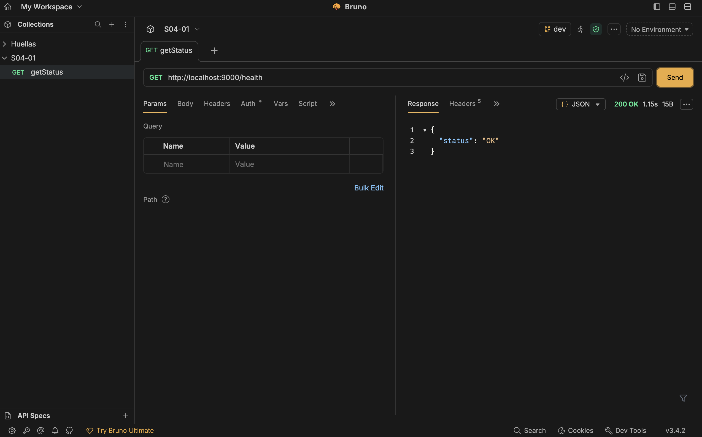
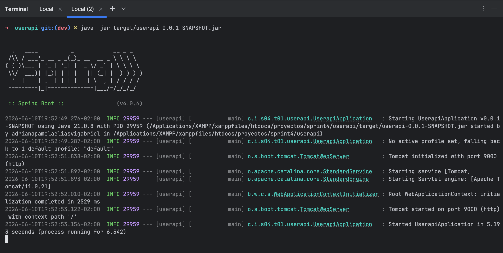

# UserApi

**Description**: Minimal yet functional REST API for user management. First contact with Spring Boot and REST API development, endpoint management, in-memory data handling, and layered architecture. Implementation of good practices in Spring Boot development from the start.

---

## 🎉 Project Status

| Status | Details |
|--------|---------|
| **Completion** | ✅ 100% - All 3 Levels Implemented |
| **Language** | 🇬🇧 English (Fully Translated) |
| **API Endpoints** | ✅ All endpoints functional with Service Layer |
| **Tests** | ✅ Integration & Unit Tests (with Mockito & TDD) |
| **Architecture** | ✅ Layered (Controller → Service → Repository) |
| **Documentation** | ✅ Complete with diagrams and examples |
| **Port** | 9000 |
| **Build** | ✅ Maven clean package |
| **Ready to Deploy** | ✅ Yes - Production Ready (Educational) |

### Recent Implementations:
- ✅ **Service Layer**: UserService interface and UserServiceImpl (TDD approach)
- ✅ **Unit Testing**: Mockito-based tests for service layer
- ✅ **Dependency Injection**: Spring @Service and @Repository annotations

---

## 📌 Exercise Statement

This exercise is your first contact with **Spring Boot** and **REST API** development. The goal is to build a minimal yet functional API that allows receiving and returning data in JSON format, using HTTP methods and applying good practices from the beginning.

### Key concepts covered:
- ✅ What is a REST API and how it works
- ✅ Defining endpoints with `@RestController`
- ✅ HTTP GET and POST methods
- ✅ Receiving data with `@PathVariable` and `@RequestParam`
- ✅ Receiving JSON with `@RequestBody`
- ✅ Returning JSON responses
- ✅ Testing with MockMvc, `@SpringBootTest` and Mockito
- ✅ Compiling and running `.jar` files with Maven
- ✅ Inversion of Control (IoC) and Dependency Injection
- ✅ Layered architecture: Controller → Service → Repository

---

## ✨ Features

### Level 1: Basic REST API
- ✅ **GET /health** - Health check endpoint returning `{"status": "OK"}`
- ✅ Structured JSON response
- ✅ Automated tests with MockMvc
- ✅ Application startup verification

### Level 2: In-Memory User Management
- ✅ **GET /users** - Get all users
- ✅ **POST /users** - Create a new user
- ✅ **GET /users/{id}** - Get a user by ID
- ✅ **GET /users?name=...** - Filter users by name (case-insensitive)
- ✅ Unique UUID generation for each user
- ✅ Exception handling with `UserNotFoundException` (HTTP 404)
- ✅ Endpoint tests with MockMvc
- ✅ DTO (Data Transfer Object) for requests

### Level 3: Layered Architecture
- ✅ **Repository Pattern**: `UserRepository` interface with `InMemoryUserRepository` implementation
- ✅ Clear separation of concerns
- ✅ Repository unit tests with assertions
- ✅ **Service Layer**: `UserService` interface with `UserServiceImpl` implementation
- ✅ Business logic centralized in the service layer
- ✅ Unit tests using Mockito with TDD approach
- ✅ Dependency injection with Spring (@Service, @Repository)
- ✅ Structure ready for future database integration

---

## 🛠 Technologies

- **Backend**: 
  - Java 21 (LTS)
  - Spring Boot 4.0.6
  - Spring Web MVC
  - Spring Boot DevTools
  
- **Testing**:
  - JUnit 5 (Jupiter)
  - MockMvc
  - Mockito
  - AssertJ

- **Build**:
  - Maven 3.8+
  - Apache Maven Compiler Plugin

- **Server**:
  - Apache Tomcat (embedded in Spring Boot)

- **Data Format**: 
  - JSON (Jackson - automatic deserialization)

---

## 🚀 Installation and Execution

### Prerequisites
- **Java 21** or higher
- **Maven 3.8+**
- **Git**
- Editor: IntelliJ IDEA, VS Code, Eclipse or similar

### 1. Clone the repository
```bash
git clone https://github.com/yourusername/userapi.git
cd userapi
```

### 2. Environment variables and configuration
The application is already pre-configured at `src/main/resources/application.properties`:
```properties
spring.application.name=userapi
server.port=9000
```

If you want to modify the port or other parameters, edit this file.

### 3. Install dependencies
```bash
mvn clean install
```

### 4. Run the application

#### Option A: With Maven (development mode with auto-reload)
```bash
mvn spring-boot:run
```

#### Option B: With the IDE (IntelliJ IDEA)
1. Open the project
2. Right-click on `UserapiApplication.java`
3. Select "Run 'UserapiApplication'"

The application will be available at: **http://localhost:9000**

### 5. Automated testing

#### Run all tests
```bash
mvn test
```

#### Run tests with detailed output
```bash
mvn test -X
```

#### Run tests for a specific class
```bash
mvn test -Dtest=HealthControllerTest
mvn test -Dtest=InMemoryUserRepositoryTest
mvn test -Dtest=UserControllerTest
```

#### Skip tests during package
```bash
mvn clean package -DskipTests
```

### 6. Package as executable .jar

```bash
mvn clean package
```

This will generate: `target/userapi-0.0.1-SNAPSHOT.jar`

### 7. Run the application from .jar

```bash
java -jar target/userapi-0.0.1-SNAPSHOT.jar
```

The application will be available at: **http://localhost:9000**

To stop the application, press: **Ctrl + C**

---

## 📸 Demo

### API Testing with Bruno (REST client)

Endpoints have been tested with Bruno and Postman:



### Automated test results



### Available endpoints - cURL examples

```bash
# 1. Health Check
curl -X GET http://localhost:9000/health
# Response: {"status":"OK"}

# 2. List all users (initially empty)
curl -X GET http://localhost:9000/users
# Response: []

# 3. Create a new user
curl -X POST http://localhost:9000/users \
  -H "Content-Type: application/json" \
  -d '{"name":"Ada Lovelace","email":"ada@example.com"}'
# Response: {"id":"550e8400-e29b-41d4-a716-446655440000","name":"Ada Lovelace","email":"ada@example.com"}

# 4. Get a user by ID
curl -X GET http://localhost:9000/users/550e8400-e29b-41d4-a716-446655440000
# Response: {"id":"550e8400-e29b-41d4-a716-446655440000","name":"Ada Lovelace","email":"ada@example.com"}

# 5. Filter users by name
curl -X GET "http://localhost:9000/users?name=ada"
# Response: [{"id":"550e8400-e29b-41d4-a716-446655440000","name":"Ada Lovelace","email":"ada@example.com"}]

# 6. Search for non-existent user (returns 404)
curl -X GET http://localhost:9000/users/invalid-id
# Response: Error 404 - User not found
```

---

## 🧩 Diagrams and Technical Justification

### User creation flow diagram (Level 2)

```
┌─────────┐
│ Client  │
└────┬────┘
     │ HTTP POST /users
     │ {"name":"Ada","email":"ada@example.com"}
     ▼
┌──────────────────────────────────┐
│ UserController                   │
│ - Process HTTP request           │
│ - Validate JSON format           │
│ - Delegate to service            │
└────┬─────────────────────────────┘
     │ userService.createUser(dto)
     ▼
┌──────────────────────────────────┐
│ UserServiceImpl (Level 2)         │
│ - Generate UUID                  │
│ - Create User object             │
│ - Call repository                │
└────┬─────────────────────────────┘
     │ userRepository.save(user)
     ▼
┌──────────────────────────────────┐
│ InMemoryUserRepository           │
│ - Add to List<User>              │
└────┬─────────────────────────────┘
     │ return created user
     ▼
┌──────────────────────────────────┐
│ Client (HTTP 201 Created)        │
│ {"id":"...","name":"Ada",...}    │
└──────────────────────────────────┘
```

### Layered architecture diagram (Level 3)

```
HTTP REQUEST (GET, POST, etc.)
     │
     ▼
┌────────────────────────────────────────┐
│  Controller Layer                      │
│  UserController                        │
│  ├─ @RestController                    │
│  ├─ @GetMapping, @PostMapping          │
│  └─ Responsibility: HTTP Protocol      │
└────────┬─────────────────────────────┘
         │ injection: UserService
         ▼
┌────────────────────────────────────────┐
│  Service Layer                         │
│  UserServiceImpl implements UserService│
│  ├─ @Service                           │
│  ├─ Business logic                     │
│  ├─ Validations                        │
│  └─ Responsibility: Business rules     │
└────────┬─────────────────────────────┘
         │ injection: UserRepository
         ▼
┌────────────────────────────────────────┐
│  Repository Layer                      │
│  ├─ UserRepository (Interface)         │
│  ├─ InMemoryUserRepository             │
│  ├─ @Repository                        │
│  └─ Responsibility: Data access        │
└────────┬─────────────────────────────┘
         │
         ▼
┌────────────────────────────────────────┐
│  Data Source                           │
│  ├─ List<User> (current memory)        │
│  ├─ MySQL/PostgreSQL (future)          │
│  └─ MongoDB (future)                   │
└────────────────────────────────────────┘
```

### Technical Decision Justification

#### 1. **Java 21 + Spring Boot 4.0.6**
- ✅ Java 21 is LTS (Long Term Support) - supported until 2028
- ✅ Spring Boot 4.0.6 offers latest improvements and full support
- ✅ Java 15+ Records simplify DTOs without boilerplate
- ✅ Better performance and security

#### 2. **Layered architecture (3-tier architecture)**
- ✅ **Separation of concerns**: Each layer has a clear and well-defined role
- ✅ **Testability**: Each layer can be tested in isolation with mocks
- ✅ **Maintainability**: Changes in one layer don't affect others
- ✅ **Scalability**: Easy to add new features without modifying existing code
- ✅ **Reusability**: Business logic can be used from multiple channels (web, CLI, API)

#### 3. **UUID for identifiers**
- ✅ **Unique** identifiers without database dependency
- ✅ **Security**: IDs are not sequential (next ID cannot be predicted)
- ✅ **Distributed**: Works well in distributed systems without coordination
- ✅ **Industry standard**: Widely adopted in modern APIs

#### 4. **Repository Pattern**
- ✅ **Decoupling**: Service doesn't know how data is stored
- ✅ **Flexibility**: Switch from memory to database without touching service
- ✅ **Testability**: Mock repository to test service in isolation
- ✅ **Reusability**: Same repository for multiple implementations

#### 5. **In-memory vs Database**
- ✅ **Simplicity**: Easier to understand concepts without database complexity
- ✅ **Test speed**: Tests are fast without network I/O
- ✅ **Preparation**: Structure ready for easy transition to real database
- ✅ **Education**: Gradual approach: Levels 1-2 without layers, Level 3 with layers

#### 6. **DTOs (Data Transfer Objects)**
- ✅ **Decoupling**: HTTP requests decoupled from business entities
- ✅ **Future validation**: Right place to add Bean Validation
- ✅ **Flexibility**: Allow partial field requests
- ✅ **Security**: Don't expose all entity fields

#### 7. **Multi-level testing**
- ✅ **MockMvc**: Fast tests without starting full server
- ✅ **Mockito**: Simulate dependencies for isolated unit tests
- ✅ **AssertJ**: Fluent and readable assertions
- ✅ **Coverage**: Verify tested code is sufficient

#### 8. **Service Layer Implementation (TDD Approach)**
- ✅ **Centralized Business Logic**: UserService handles all business rules
- ✅ **Dependency Inversion**: Controller depends on service interface, not implementation
- ✅ **Test-Driven Development**: Unit tests with Mockito define behavior before implementation
- ✅ **Easier to Mock**: Service dependencies can be easily mocked for isolated testing

---

## 📂 Project Structure

```
userapi/
├── src/
│   ├── main/
│   │   ├── java/
│   │   │   └── cat/itacademy/s04/t01/userapi/
│   │   │       ├── UserapiApplication.java              (Spring Boot entry point)
│   │   │       │
│   │   │       ├── level1/                              (LEVEL 1: Health Check)
│   │   │       │   ├── Status.java                      (Response DTO)
│   │   │       │   └── controllers/
│   │   │       │       └── HealthController.java        (Endpoint /health)
│   │   │       │
│   │   │       └── level2 & level3/                     (LEVEL 2 & 3: User CRUD with Service Layer)
│   │   │           ├── controller/
│   │   │           │   └── UserController.java          (Endpoints /users - now uses Service)
│   │   │           ├── service/
│   │   │           │   ├── UserService.java             (Service interface - Level 3)
│   │   │           │   └── UserServiceImpl.java          (Service implementation - Level 3)
│   │   │           ├── model/
│   │   │           │   └── User.java                    (User entity)
│   │   │           ├── dto/
│   │   │           │   └── CreateUserRequest.java       (Input DTO)
│   │   │           ├── repositories/
│   │   │           │   ├── UserRepository.java          (Interface - abstraction)
│   │   │           │   └── InMemoryUserRepository.java  (Implementation - memory)
│   │   │           └── exceptions/
│   │   │               └── UserNotFoundException.java   (Custom exception)
│   │   │
│   │   └── resources/
│   │       └── application.properties                   (Spring configuration)
│   │
│   ├── test/
│   │   └── java/
│   │       └── cat/itacademy/s04/t01/userapi/
│   │           ├── level1/
│   │           │   └── controllers/
│   │           │       └── HealthControllerTest.java    (Level 1 test)
│   │           │
│   │           └── level2 & level3/
│   │               ├── UserControllerTest.java          (Integration tests - Level 2)
│   │               ├── repositories/
│   │               │   └── InMemoryUserRepositoryTest.java (Level 3 repository tests)
│   │               └── service/
│   │                   └── UserServiceImplTest.java     (Level 3 unit tests with Mockito)
│   │
│   └── docs/
│       └── screenshots/
│           ├── bruno-results.png                        (Endpoint tests)
│           └── test-results.png                         (Test results)
│
├── target/                                              (Build folder - auto-generated)
│   ├── userapi-0.0.1-SNAPSHOT.jar                      (Executable JAR)
│   └── ...
│
├── pom.xml                                              (Maven dependencies)
├── mvnw                                                 (Maven wrapper Linux/Mac)
├── mvnw.cmd                                             (Maven wrapper Windows)
├── README.md                                            (This file)
└── HELP.md                                              (Additional help)
```

### Level explanation

| Level | Folder | Topic | Goal |
|-------|--------|-------|------|
| **Level 1** | `level1/` | Health Check | Verify API works and returns structured JSON |
| **Level 2** | `level2/level3/` | Basic CRUD | Manage users with GET/POST/GETBYID/FILTER endpoints |
| **Level 3** | `level2/level3/` | Layered architecture | Refactor with Repository Pattern and Dependency Injection |

---

## 🧪 Tests

### Test Coverage

```
✅ HealthControllerTest              → Verifies GET /health
✅ UserControllerTest                → Integration tests for CRUD endpoints
✅ InMemoryUserRepositoryTest       → Unit tests for repository pattern
✅ UserServiceImplTest              → Unit tests for business logic (Mockito + TDD)
```

### Running tests with Maven

```bash
# All tests (compile + tests)
mvn clean test

# Specific test
mvn test -Dtest=HealthControllerTest

# Specific test method
mvn test -Dtest=InMemoryUserRepositoryTest#findAll_neverReturnsNull

# Tests with detailed output
mvn test -X

# Tests without surefire output
mvn test -q

# Skip tests (compile only)
mvn clean install -DskipTests
```

### View test coverage

```bash
# Generate coverage report (if JaCoCo is configured)
mvn clean test jacoco:report

# Results would be at: target/site/jacoco/index.html
```

---

## 🔍 Endpoints Reference

| Method | Endpoint | Description | Request Body | Possible Status |
|--------|----------|-------------|--------------|-----------------|
| GET | `/health` | Health check | - | 200 OK |
| GET | `/users` | List all | - | 200 OK |
| GET | `/users?name=X` | Search by name | - | 200 OK |
| GET | `/users/{id}` | Get by ID | - | 200 OK, 404 Not Found |
| POST | `/users` | Create user | `{"name":"...","email":"..."}` | 200 OK, 400 Bad Request |

### cURL request examples

```bash
# 1. Health check
curl -i http://localhost:9000/health
# Headers: HTTP/1.1 200 OK
# Body: {"status":"OK"}

# 2. Create user (first request - stored in memory)
RESPONSE=$(curl -s -X POST http://localhost:9000/users \
  -H "Content-Type: application/json" \
  -d '{"name":"Ada Lovelace","email":"ada@example.com"}')
echo $RESPONSE
# Body: {"id":"550e8400-e29b-41d4-a716-446655440000","name":"Ada Lovelace","email":"ada@example.com"}

# 3. List all users
curl -i http://localhost:9000/users
# Headers: HTTP/1.1 200 OK
# Body: [{"id":"550e8400-e29b-41d4-a716-446655440000","name":"Ada Lovelace","email":"ada@example.com"}]

# 4. Filter users by name (case-insensitive)
curl -i "http://localhost:9000/users?name=ada"
# Headers: HTTP/1.1 200 OK
# Body: [{"id":"550e8400-e29b-41d4-a716-446655440000","name":"Ada Lovelace","email":"ada@example.com"}]

# 5. Get user by ID
curl -i http://localhost:9000/users/550e8400-e29b-41d4-a716-446655440000
# Headers: HTTP/1.1 200 OK
# Body: {"id":"550e8400-e29b-41d4-a716-446655440000","name":"Ada Lovelace","email":"ada@example.com"}

# 6. Search for non-existent user (404)
curl -i http://localhost:9000/users/00000000-0000-0000-0000-000000000000
# Headers: HTTP/1.1 404 Not Found
# Body: User with id 00000000-0000-0000-0000-000000000000 not found
```

### Testing with Postman

1. **Import collection**: `S04-01/bruno.json`
2. **Set variable**: `base_url = http://localhost:9000`
3. **Execute requests in order**:
   - Health Check
   - Get All Users (empty)
   - Create User 1
   - Create User 2
   - Get All Users (with data)
   - Get User By ID
   - Filter by Name
   - Get Invalid ID (404)

---

## 🚀 Roadmap and Future Improvements

- [ ] MySQL / PostgreSQL database
- [ ] JWT / OAuth2 authentication
- [ ] Bean Validation (@NotBlank, @Email, etc.)
- [ ] Result pagination (Pageable)
- [ ] Update users (PUT /users/{id})
- [ ] Delete users (DELETE /users/{id})
- [ ] Swagger / OpenAPI documentation
- [ ] Docker & Docker Compose
- [ ] CI/CD with GitHub Actions
- [ ] Logging with SLF4J / Logback
- [ ] Global error handling with @ControllerAdvice
- [ ] CORS (Cross-Origin Resource Sharing)
- [ ] Rate Limiting
- [ ] Cache (Redis)

---

## 📚 Resources and Bibliography

- [Spring Boot Official Documentation](https://docs.spring.io/spring-boot/docs/)
- [Spring Framework Reference - Web MVC](https://docs.spring.io/spring-framework/reference/web/webmvc.html)
- [Testing in Spring Boot Guide](https://spring.io/guides/gs/testing-web/)
- [MockMvc Documentation](https://docs.spring.io/spring-framework/docs/current/javadoc-api/org/springframework/test/web/servlet/MockMvc.html)
- [Mockito Documentation](https://javadoc.io/doc/org.mockito/mockito-core/latest/org/mockito/Mockito.html)
- [JUnit 5 User Guide](https://junit.org/junit5/docs/current/user-guide/)
- [AssertJ Assertions Library](https://assertj.github.io/assertj-core/)
- [Repository Pattern - Martin Fowler](https://martinfowler.com/eaaCatalog/repository.html)
- [Dependency Injection in Spring](https://docs.spring.io/spring-framework/reference/core/beans/dependencies/factory-collaborators.html)
- [REST API Best Practices](https://restfulapi.net/)

---

## ✍️ Commit Conventions

The project follows **Conventional Commits** (semantic commits):

```bash
# New feature - Add new functionality
git commit -m "feat: add GET /users endpoint"
git commit -m "feat: implement name filter with @RequestParam"

# Bug fix - Fix bugs
git commit -m "fix: fix case-sensitive name filter"
git commit -m "fix: handle invalid UUID at GET /users/{id}"

# Test - Add or modify tests
git commit -m "test: add tests for UserRepository"
git commit -m "test: verify POST /users returns UUID"

# Refactoring - Code improvement without changing functionality
git commit -m "refactor: move logic to service layer"
git commit -m "refactor: extract UserRepository interface"

# Documentation - Update README, comments, etc.
git commit -m "docs: update README with testing instructions"
git commit -m "docs: add cURL examples to endpoints"

# Performance - Performance improvements
git commit -m "perf: optimize name filter with streams"

# Style - Format, indentation, etc.
git commit -m "style: apply standard Java formatting"
```

---

## 📝 License

This project is part of the **itAcademy Sprint 4.01** educational program.
Educational purposes - Barcelona Activa

---

## 👨‍💻 Author

**Creation Date**: June 2026
**Institution**: IT Academy - Barcelona Activa  
**Level**: Apprentice / Junior Developer

---

## ❓ Frequently Asked Questions (FAQ)

### Q: How do I change the API port?
**A**: Edit `src/main/resources/application.properties`:
```properties
server.port=8080  # Change 9000 to 8080 (or your desired port)
```

### Q: How do I add a new Maven dependency?
**A**: 
1. Edit `pom.xml`
2. Add dependency within `<dependencies>`
3. Run `mvn clean install` to download it

Example:
```xml
<dependency>
    <groupId>org.springframework.boot</groupId>
    <artifactId>spring-boot-starter-validation</artifactId>
</dependency>
```

### Q: Why are my tests failing?
**A**: Verify that:
- You have Java 21 installed: `java -version`
- You've run `mvn clean install` first
- Port 9000 is not in use: `lsof -i :9000` (Mac/Linux)
- No compilation errors: `mvn compile`

### Q: Can I use a real database instead of memory?
**A**: Yes! Steps are:
1. Create new class `DatabaseUserRepository implements UserRepository`
2. Connect to database with JDBC or JPA
3. Inject `DatabaseUserRepository` instead of `InMemoryUserRepository`
4. Service and controller **don't need changes** (thanks to repository pattern!)

### Q: How do I add field validation (email, non-blank)?
**A**: Add dependency and annotations:
```xml
<!-- In pom.xml -->
<dependency>
    <groupId>org.springframework.boot</groupId>
    <artifactId>spring-boot-starter-validation</artifactId>
</dependency>
```

```java
// In CreateUserRequest.java
public record CreateUserRequest(
    @NotBlank(message = "Name cannot be empty")
    String name,
    
    @Email(message = "Email must be valid")
    String email
) { }
```

### Q: How do I view application logs?
**A**: Logs are shown in console when running:
```bash
mvn spring-boot:run
```

For advanced configuration, edit `src/main/resources/application.properties`:
```properties
logging.level.root=INFO
logging.level.cat.itacademy=DEBUG
```

### Q: Can I run the app from another computer?
**A**: Yes! Run the JAR specifying the IP:
```bash
java -jar target/userapi-0.0.1-SNAPSHOT.jar --server.address=0.0.0.0
```
Then access from another PC at: `http://SERVER_IP:9000/health`

### Q: What are the differences between Levels 1, 2, and 3?
**A**:
| Level | Focus | Patterns | Database |
|-------|-------|----------|----------|
| 1 | Basic Health Check | @RestController | - |
| 2 | Simple CRUD | Controllers + DTOs | Memory |
| 3 | Professional Architecture | Controller+Service+Repository | Memory (future: DB) |

---

## 🤝 Contributions

Contributions are welcome! For major changes:
1. Fork the repository
2. Create a new branch: `git checkout -b feature/my-feature`
3. Make changes and tests
4. Semantic commits: `git commit -m "feat: description"`
5. Push to branch: `git push origin feature/my-feature`
6. Open a Pull Request

---

**Last Update**: June 15, 2026  
**Version**: 1.0.0-SNAPSHOT  
**Status**: ✅ Completed and Tested (Production Ready - Educational)  
**Language**: English 🇬🇧  
**Documentation**: Complete with diagrams, examples, and FAQ  
**Developer**: Adriana Elías  
**Institution**: IT Academy - Barcelona Activa  
**Level**: Apprentice / Junior Developer  

